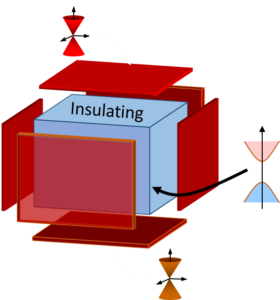
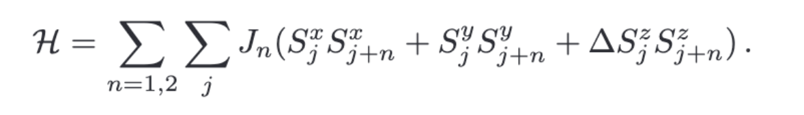
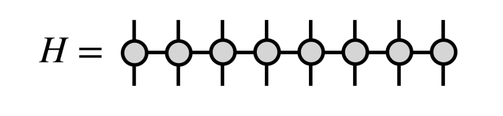
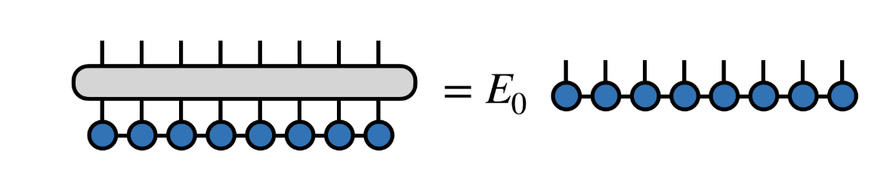
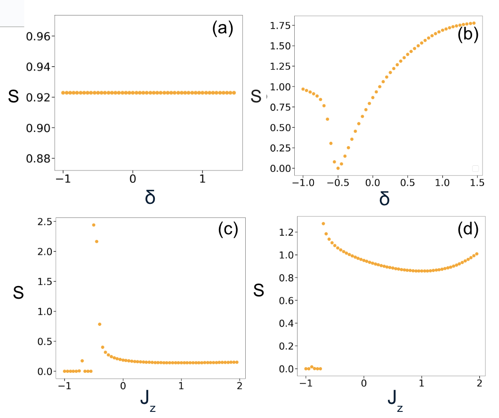
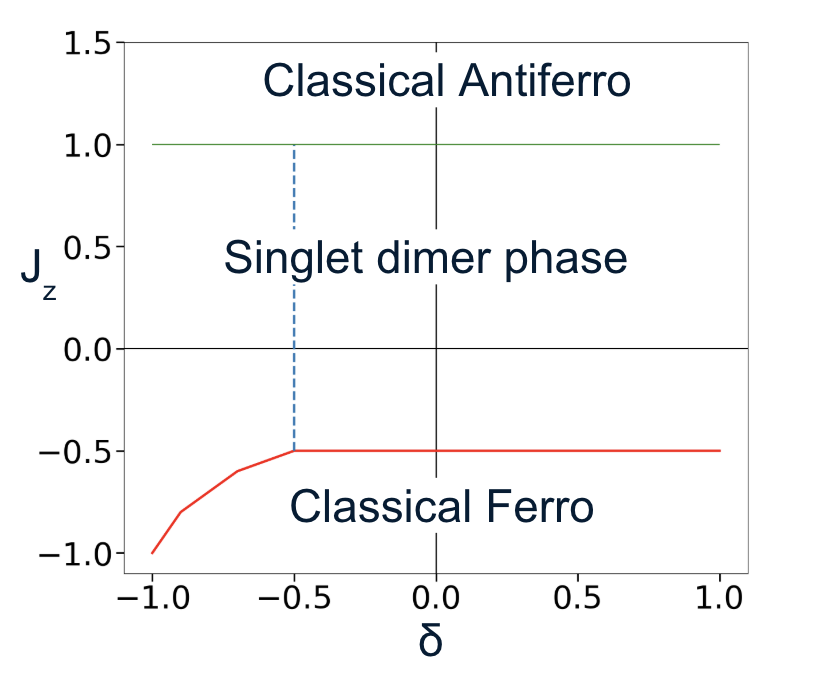

# Topological Insulator
Topological Insulators are a remarkable class of quantum material that bahave as **insulators in their inside** while **conducting in their outside**. In this way, we could greatly reduce the dissipation in current transportation. So far, physicists have proposed numerous physical and mathematical models in simulating the topological insulator. 
 

# Next-Nearest-Neighbor Spin Chain
Among the physical models, Next-Nearest Neighbor Spin Chain is one of the most popular ones. The major reason is that 
1. It supports relatively rich quantum phases
2. It possesses robust surface state(the conducting surface), 
3. It could serve as paradigm of wide range of materials

# Model and Hamiltonian
For a spin chain, we'd use Spin operators for our study. The Hamiltonian is  

 

The schematic represents its interactions is  
 

In this specific case, in order to better parametrize the Hamiltonian, I've introduced another parameter, δ, where the couplings in this Hamiltonian are specified as  
  

# Method
In this project, I'll be most interested in the Entanglement Entropy of the ground state. By probing the Entanglement Entropy, I'd like to construct a phase diagram of the model, and obtain an understanding of the property of each phase.
## Entanglement Entropy
I bet you guys have heard of Entanglement in Quantum Mechanis. There's a popular story of "spooky action at a distance": having two gloves - you send one to North Pole without looking, and when your friend at South Pole opens theirs and finds a left-handed glove, yours instantly becomes right-handed. This story demonstrates two particles, after interacting, even though being separated, would still affect each other

In modern physics, we have an important variable, called Entanglement Entropy, that could be used to describe how two parts of a system Entangles. This variable is super important since it carries out the property of the whole system and could be served to distinguish two different topological phases.

In this project, I am mainly interested in the Bipartite Von-Neumann Entanglement Entropy. The way to cut the system is by cutiing the system exactly in half of its length, demonstrated in the following figure 
 

# Algorithm: Density Matrix Renormalization Group(DMRG)
Density Matrix Renormalization Group is a powerful algorithm in studying a relatively large system. In modern physics, we are sometimes interested a system with large amount of particles(like 50-100 or so), which is impossible to calculate even for a computer

However, through certain mathematical renormalization strategy, DMRG allows us to reduce the solution space we need to calculate, and calculate our most interested state(usually ground state) efficiently and precisely

### It's like a brilliant editor for a quantum story, cutting out the fluff and keeping only the essential plot. ###  

 

 

# Result
We've explored the parameter speace by sweeping through δ and Jz, and some representative results are shown below(more detailed ones could be found in images folder). When Jz>1.0, this spin chain enters anti-ferromagentic regime, where no transition is observed, as shown in figure 1. When Jz is between 1.0 and -0.5, a sigular point where S=0 could be observed. This specific singular point corresponds to the state of singlet bond, which is also stressed in Majumder–Ghosh model. In this singular point, the model would form singlet dimers throughout the model, causing the Entanglement Entropy to be zero in between the dimers. When Jz<-0.5, the Entanglement Entropy shrinks to zero, as specified in figure 3 and 4. In this regime, the Jz interaction dominates, forcing the spins to align in parallel with each other, so we could name this region as Ferromagnetic region.  

  

The sweep of S with respect to parameter space, where (a)sweep through δ with Jz=1.0 (b)Sweep through δ with Jz=0.5 (c) Sweep through Jz with δ=-0.4 (d) Sweep through Jz with δ=-0.8

Concluded from what we get, I've roughly sketched the phase diagram of this model, shown in the following image  

 

